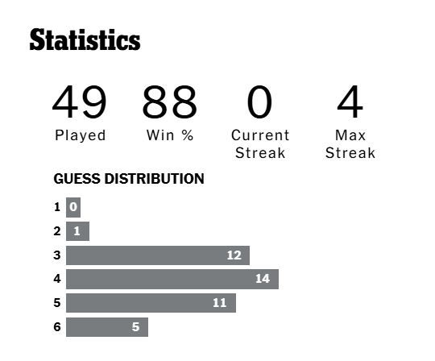
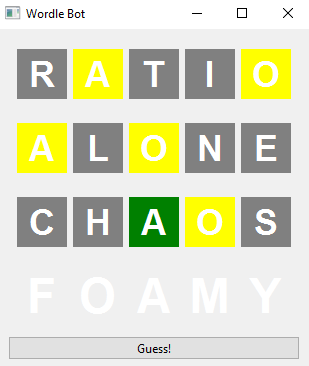

# Wordle_Bot

A simple bot to play the game 'Wordle' as optimally as possible

In Version 1 I have achieved 98.2% win accuracy over 500 attempts. If I find the time I would like to get this to 100%. Below is a comparison of when I play Wordle vs when the bot plays wordle

Here are my personal stats:

And here are the stats of Version 1:

The bot has a user interface that works in a similar way to the real Wordle game and allow users to use the bot to generate guesses. 

I need to compile this into an exectuable at some point. I am using python and pyqt for this project.
